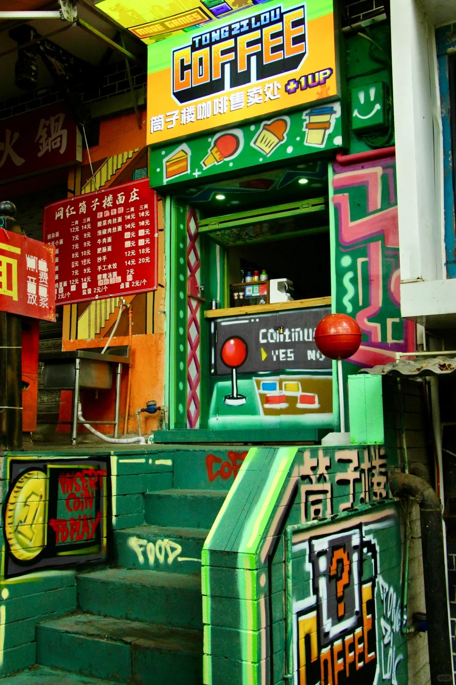
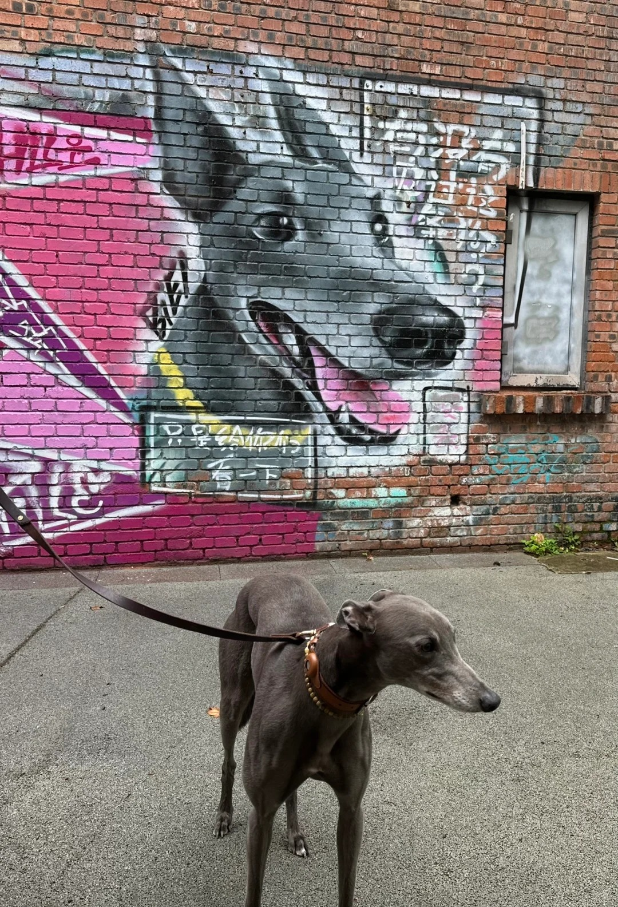

I hired a designer from Sichuan Fine Arts Institute, the one who painted Zhao Liying.

<!--more-->

"王爷" was so popular that I posted a "seeking wall painting design" post, and Xiaohongshu pushed it to me.

I took photos of my store to the designer, and he suggested packaging the entire store as a "vending machine" or "arcade machine." I had never imagined it that way before, but I trusted them unconditionally. After all, they did an amazing job painting Zhao Liying (luckily, I found them before they finished the second painting of Zhao Liying).

After inspecting the site, the designer said, "No problem, we can finish it in a day." However, I didn't expect that traveling back and forth from Sichuan Fine Arts Institute to Haitangxi, a total of 80 kilometers, and making four trips, it still wasn't completely done (mainly due to weather and issues left by the previous store owner).

The designer has a West Highland White Terrier, which he brings along every time he comes. Whenever it stands at my store entrance, it attracts a lot of attention from passersby. The designer suggested that I get one too to increase foot traffic. I laughed and said, "I'm not sure my small shop earns enough to support it."

