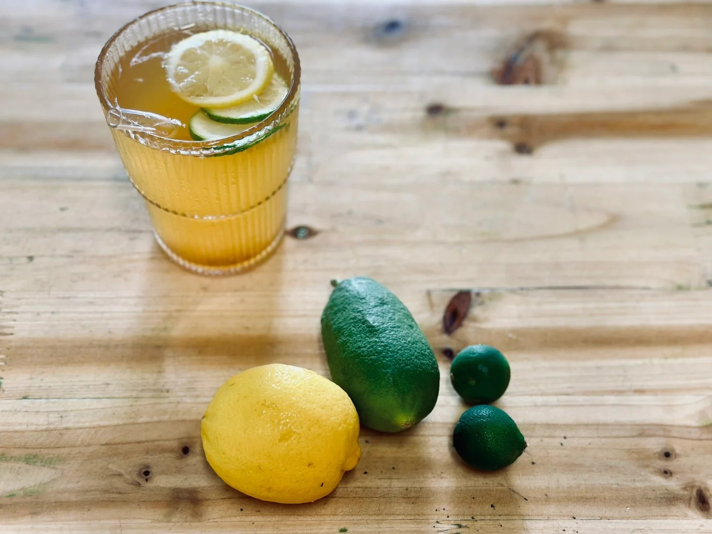

1-2 slices of yellow lemon + 2 slices of kaffir lime + 30ml preserved plum syrup + 300ml tea + ice.

[Chinese version](https://www.xiaohongshu.com/explore/663f31c2000000001e026468)

<!--more-->

### 🍋 Lemon: Yellow Lemon + Key Lime vs. Yellow Lemon + Kaffir Lime

Flavor: Using the same base recipe, the former combination has a stronger lemon flavor, is more sour, and turns slightly bitter after sitting for more than 2 hours (p4, first cup). The latter combination is more aromatic, has a milder lemon flavor, and its taste remains almost unchanged after 2 hours (p4, third cup).

Cost: I did not pay much attention to the prices, but they are likely similar.

### 🍵 Tea: Homemade Jasmine Tea ("12g of jasmine tea brewed with 600ml of 85°C water") vs. Shangyun Floral Extract ("35ml jasmine extract + 15ml preserved plum syrup + 250ml drinking water")

Flavor: Using the same lemons, the former has a stronger tea fragrance and a subtle jasmine scent, with the flavor changing over time due to the lemon. The latter lacks the tea fragrance, has a sweet jasmine aroma, and becomes sweeter after sitting for more than 2 hours (p4, second cup).

Cost: Homemade tea << Floral extract

### 🍬 Preserved Plum Syrup: Licorice Plum vs. Six-flavor Old Plum

Flavor: Using the same syrup ratio to soak the plums, the former only has a sweet syrup flavor without the plum taste, which is difficult to describe. The latter has a strong plum flavor with a well-balanced overall taste.

Cost: Licorice Plum << Six-flavor Old Plum

### Other Notes

I also tried using sour plum paste, which pairs better with roast goose. Additionally, I experimented with soaking plums in Morin syrup. While the flavor was excellent, the cost was too high.
