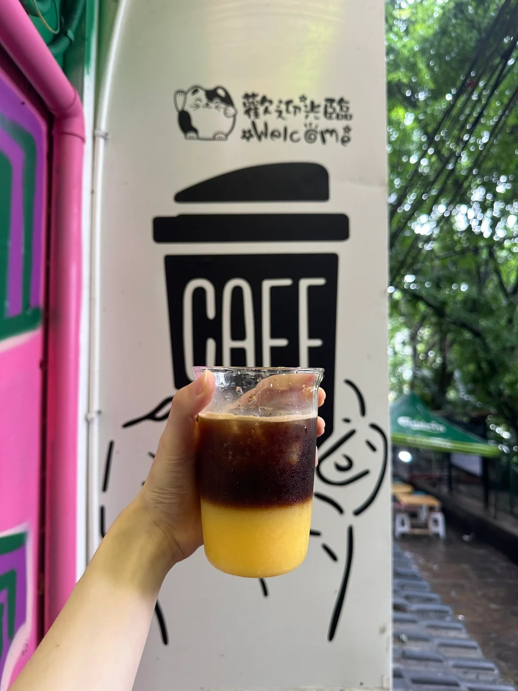
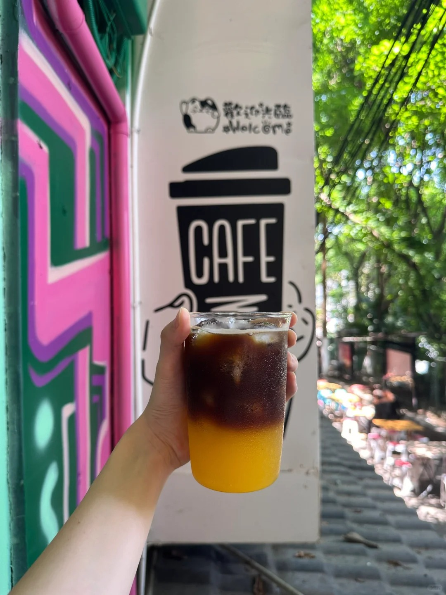

## Recipe

150ml orange juice + double espresso + 30~50ml water + ice.

[Chinese version](https://www.xiaohongshu.com/explore/667d0b64000000001d01bb40?xsec_token=AB2HMiK3qLo9BQK9tWGrZKQiE5LdC3y6S9m1Zm97DqoYQ=&xsec_source=pc_user)

<!--more-->

## Review

### Orange Juice Options: Freshly squeezed VS Qoo VS NFC 

1. Color: I personally love the color of blood orange juice. It’s different from the typical Orange C Americano look (see cover).
NFC juice is also a freshly squeezed option with high juice concentration, making it easier to achieve layering compared to Qoo.

1. Flavor:The taste of blood orange juice and NFC is quite similar. The juice itself has a tangy and slightly bitter flavor, which combined with the bitterness of coffee, isn’t very palatable without added sugar. Additionally, their stronger orange flavor can overpower the coffee.
Qoo juice, on the other hand, has a milder orange flavor and is sweeter, so you don’t need extra sugar. However, you’ll need to add about 30ml more juice.
1. Cost:Freshly squeezed > NFC > Qoo
While the price of oranges themselves isn’t necessarily higher than NFC juice, fresh fruit incurs higher loss rates. Although Qoo juice is cheaper per unit, you’ll use more of it compared to the other two options.
1. Others:I’ve also tried using "Andrew Jam" to make Orange C Americano. Compared to freshly squeezed juice, it tastes more like Qoo but with added texture from the pulp. It’s delicious but expensive.

Notice: Be sure to add water to the espresso shot!
