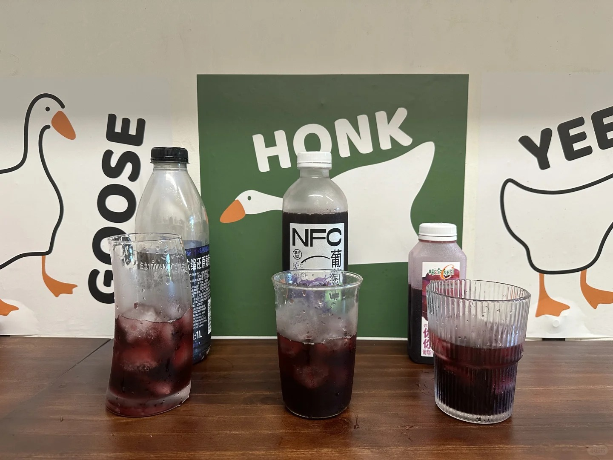

### Recipe

125ml grape juice + 55ml sparkling water + double espresso + ice.

[Chinese version](https://www.xiaohongshu.com/explore/66ac6f260000000005032a99?xsec_token=ABRb_ioBcJg_lSINZ46qTuctYR8ZqbZ-5oMR-sa9NZDI8=&xsec_source=pc_user)

<!--more-->

### Review

#### Grape Juice Options: Merlot 100% VS NFC VS Weiquan

1. Color: Merlot and NFC have a similar reddish hue, while Weiquan leans more toward purple.
2. Aroma:NFC has the most distinct grape scent with a hint of rose. The other two juices have a noticeable fermented smell, which is a bit peculiar.
3. Flavor of grape juice:Merlot is very sour. When mixed with soda water, it surprisingly develops a slight coconut milk taste—quite intriguing! NFC tasted exceptionally sweet, perhaps due to drinking after Merlot. Weiquan's sweet-and-sour profile is between the other two, with a thicker, more viscous texture.
4. Flavor of Grape Sparkling Americano: Merlot offers a balance of sourness with a touch of sweetness. Even after sitting for a while, the grape flavor remains.NFC: The grape flavor of NFC is prominent when freshly made but becomes milder as the ice melts. Weiquan lacks the acidity of Merlot and the pronounced grape flavor of NFC. However, it’s not entirely like a plain iced Americano. Adding more grape juice might enhance the flavor.
5. Cost: Merlot > NFC > Weiquan
