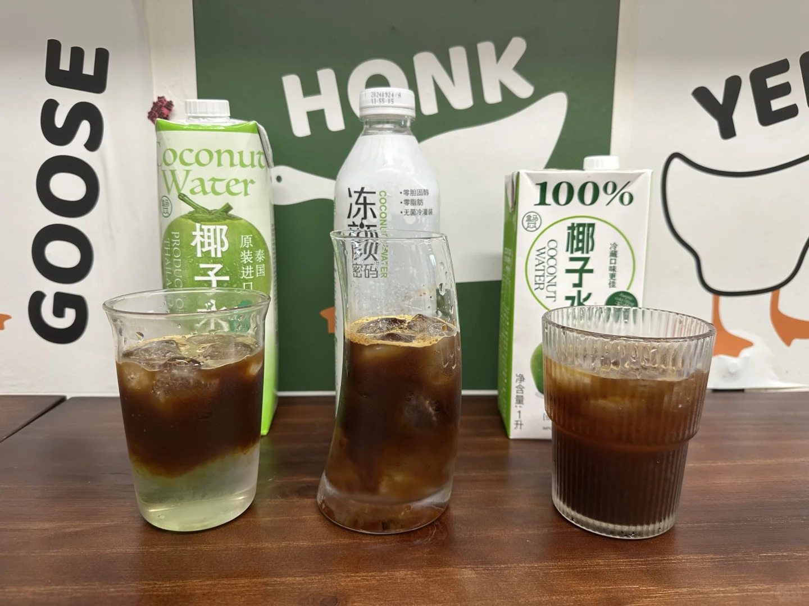

### Recipe

200ml coconut water + double espresso + one slice of kaffir lime + ice.

[Chinese version](https://www.xiaohongshu.com/explore/67038322000000002a0312a9?xsec_token=ABmhUywtVEBjtpU_xPSam3zigUc5A7xIzzb8137gERZGE=&xsec_source=pc_user)

<!--more-->

### Review

#### Coconut Water Options: Thai Imported VS Dongyanmima VS 100% Pure Coconut Water

1. Flavor of coconut waters: Thai Imported has a unique flavor reminiscent of dried coconut chips. The ingredient list shows 4.1g of sugar, but it doesn’t taste overly sweet. Dongyanmima tastes just like the fresh coconut water you’d drink during a trip to Hainan—classic, tasty, and not sweet. 100% Pure Coconut Water was my first choice. It seemed good when I didn’t compare it, but side-by-side, its coconut flavor is quite mild, and it’s noticeably sweeter.
2. Fusion speed: 100% Pure Coconut Water > Dongyanmima > Thai Imported.
3. Flavor of coconut water americano: Thai Imported tastes even more bitter than regular Americano, with a hint of medicinal bitterness 😣. The coffee flavor becomes very faint when using Dongyanmima, and the coconut water flavor is so subtle you have to really focus to notice it. The best choice for making Coconut Water Americano is 100% Pure Coconut. While the coconut flavor isn’t prominent, its sweetness balances perfectly with the bitterness of the coffee.
